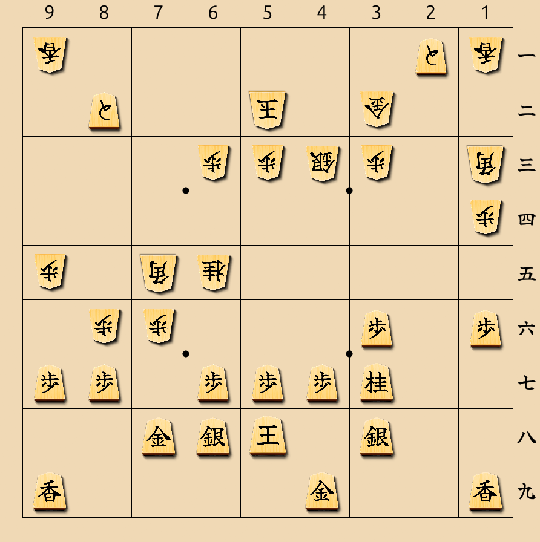
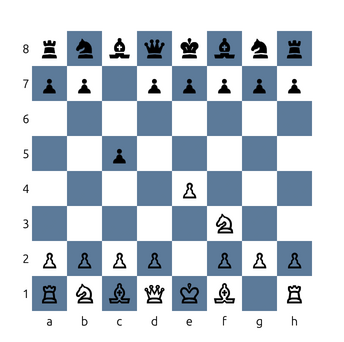

# sfen-bro

Quick board position preview tool from clipboard for shogi (SFEN) and chess (FEN).

Supports standard shogi (9x9), minishogi (5x5), and chess (8x8).

 

## Usage

1. Copy a SFEN or FEN string to your clipboard
2. Run `sfen-bro [path-to-config.json]` (you may want to bind this to a hotkey)
3. A borderless window opens displaying the board position
4. Dismiss with Escape or by clicking outside the window (losing focus)

Without a config file, shogi pieces are rendered using an included TTF font (gote pieces displayed upside down), and chess pieces use Unicode symbols with a checkerboard pattern.

## Configuration (optional)

Create a JSON config file to customize the display. The config has separate sections for shogi and chess.

```json
{
  "scale": 1.0,
  "shogi": {
    "background": "#F0D9B5",
    "grid_color": "#000000",
    "text_color": "#000000",
    "assets_path": "images/pieces",
    "pieces": {
      "K": "sente_king.png",
      "k": "gote_king.png"
    }
  },
  "chess": {
    "light_squares": "#FFFFFF",
    "dark_squares": "#5C7A99",
    "text_color": "#000000"
  }
}
```

### Global options

| Option | Description | Default |
|--------|-------------|---------|
| `scale` | Window size multiplier | `1.0` |

### Shogi options (`shogi` section)

| Option | Description | Default |
|--------|-------------|---------|
| `background` | Board background color in HTML notation | `#F0D9B5` |
| `grid_color` | Grid line color in HTML notation | `#000000` |
| `text_color` | Text color for coordinates and kanji pieces | `#000000` |
| `assets_path` | Base path for piece images (relative to config file or absolute) | config file directory |
| `pieces` | Map of SFEN characters to image paths | (none, uses kanji) |

### Chess options (`chess` section)

| Option | Description | Default |
|--------|-------------|---------|
| `light_squares` | Light square color in HTML notation | `#FFFFFF` |
| `dark_squares` | Dark square color in HTML notation | `#5C7A99` |
| `text_color` | Text color for coordinates and pieces | `#000000` |

### SFEN piece characters (shogi)

| Character | Piece |
|-----------|-------|
| K/k | King |
| R/r | Rook |
| B/b | Bishop |
| G/g | Gold |
| S/s | Silver |
| N/n | Knight |
| L/l | Lance |
| P/p | Pawn |

- Uppercase = Sente (black, moves first)
- Lowercase = Gote (white)
- `+` prefix = Promoted piece

### FEN piece characters (chess)

| Character | Piece |
|-----------|-------|
| K/k | King |
| Q/q | Queen |
| R/r | Rook |
| B/b | Bishop |
| N/n | Knight |
| P/p | Pawn |

- Uppercase = White
- Lowercase = Black

## Building

```bash
cargo build --release
```

## License

MIT
